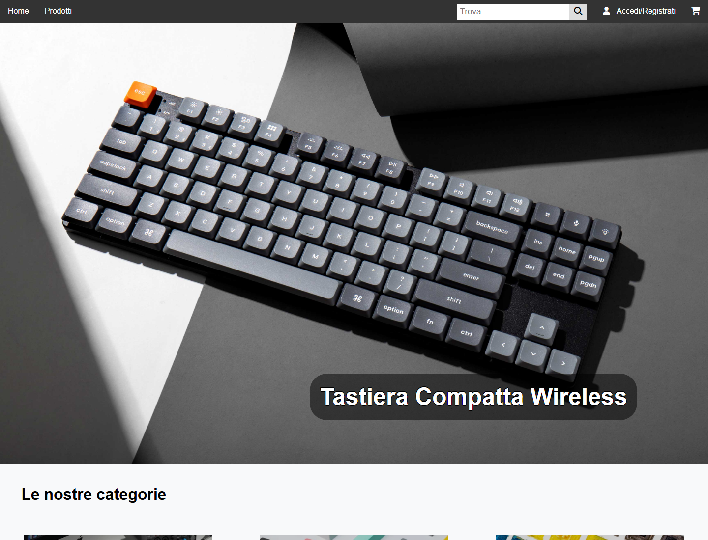

# KeyItaly

E-commerce di tastiere meccaniche e accessori: catalogo con ricerca e filtri, carrello, ordini con
fattura in PDF e un'area di amministrazione per prodotti e ordini.

> Progetto di gruppo d'esame per il corso di *Tecnologie Software per il Web* (Università degli Studi
> di Salerno, A.A. 2023/2024), realizzato con Andrea Compagnone. Docente: Prof.ssa Rita Francese.



## Avvio

L'unico prerequisito è **Docker** con Compose: Maven, MySQL e Tomcat non vanno installati, arrivano
come immagini dentro i contenitori.

```bash
git clone https://github.com/g-cer/ProgTswCerCom.git
cd ProgTswCerCom
docker compose up --build
```

L'applicazione risponde su **http://localhost:8080**. Il database viene creato e popolato al primo
avvio con 21 prodotti, alcuni utenti e uno storico ordini già pronto. Due utenze dimostrative, con
password in chiaro presenti nei dati di esempio: `admin`/`admin` (amministratore) e `gianni`/`gianni`
(utente registrato).

Gli script in `db/init/` vengono eseguiti da MySQL **solo alla prima creazione del volume**: dopo
averli modificati serve `docker compose down -v` prima di risalire, altrimenti le modifiche sembrano
non avere effetto.

## Funzionalità

Un **visitatore** non autenticato naviga la pagina principale con le novità, il catalogo completo con
ordinamento per nome, prezzo o tipo, le categorie (tastiere, switch, copritasti) e la pagina di
dettaglio; cerca con suggerimenti asincroni e riempie il carrello senza registrarsi.

Un **utente registrato**, in più, conclude l'acquisto con un indirizzo di spedizione per ordine,
consulta lo storico con il dettaglio delle righe, scarica la fattura in PDF e gestisce indirizzo e
metodo di pagamento predefiniti.

L'**amministratore** inserisce, modifica ed elimina i prodotti — con caricamento dell'immagine —
direttamente dal catalogo, e consulta tutti gli ordini con filtri per cliente e per intervallo di
date.

## Architettura

Applicazione Java EE strutturata secondo il modello **MVC**: Servlet come controller, JSP come viste
e il pattern **DAO** per la persistenza su MySQL via JDBC. Il pool di connessioni è gestito dal
container e recuperato via **JNDI**, così le credenziali non vivono nel codice ma in segnaposto che
Tomcat risolve all'avvio dalle variabili d'ambiente.

```
src/main/
├── java/
│   ├── config/        risoluzione della configurazione all'avvio
│   ├── control/       21 servlet (ordine, prodotto, search, utente)
│   ├── filter/        controllo accessi e codifica dei caratteri
│   └── model/         bean e DAO (acquisto, ordine, prodotto, utente)
└── webapp/
    ├── pages/         pagine JSP (le views/ non sono accessibili direttamente)
    ├── META-INF/      context.xml: data source JNDI
    └── WEB-INF/       web.xml
```

Autorizzazione e codifica sono concentrate in quattro filtri, anziché ripetute nelle servlet:

| Filtro | Pattern | Comportamento |
|---|---|---|
| `AdminFilter` | `/admin/*` | Richiede il ruolo amministratore |
| `UserFilter` | `/user/*` | Richiede un utente autenticato |
| `JspFilter` | `/pages/views/*` | Nega l'accesso diretto alle viste (403) |
| `EncodingFilter` | `/*` | Impone UTF-8 sul corpo delle richieste |

Una pipeline di CI (`.github/workflows/build.yml`) compila la WAR a ogni push.

## Base di dati

Quattro tabelle: `Utente 1—N Ordine 1—N Acquisto N—1 Prodotto`. Due scelte di modellazione meritano
una nota:

- **`Acquisto` fotografa prezzo, IVA e immagine** al momento dell'acquisto, così una variazione di
  listino non altera retroattivamente gli ordini conclusi né le fatture ristampate a distanza di tempo.
- **La cancellazione dei prodotti è logica** (`tipo = 'Eliminato'`): una `DELETE` violerebbe la
  chiave esterna con `Acquisto` e cancellerebbe lo storico degli ordini.

Schema e dati di esempio sono in [`db/init/`](db/init). Le immagini dei prodotti vivono fuori
dall'applicazione, in `immaginiCatalogo/`, così quelle caricate dall'amministratore sopravvivono a un
nuovo deploy. Tutti i parametri (porte, credenziali, cartella immagini) hanno un default e sono
configurabili copiando [`.env.example`](.env.example) in `.env`.

L'avvio senza Docker — JDK 11, Maven, MySQL e Tomcat 9 configurati a mano — è descritto nel documento
di progetto.

## Documentazione

Il documento di progetto è unico: **[Project Proposal](docs/project-proposal.pdf)**. Raccoglie la
proposta iniziale — obiettivi, analisi dei competitor, funzionalità, diagramma navigazionale, mappa
dei contenuti, schema della base di dati, layout e palette — e si chiude con una sezione sul sistema
effettivamente realizzato, incluse le differenze fra schema concettuale e schema implementato e le
istruzioni di deployment.

I sorgenti LaTeX sono in [`docs/`](docs) e si compilano con `latexmk -pdf project-proposal.tex`; i
diagrammi sono disegnati in TikZ, quindi modificabili senza strumenti esterni.

## Limiti noti

Il progetto ha finalità didattiche. Alcune scelte, accettabili in quel contesto, non sarebbero
adeguate a un sistema in esercizio; sono elencate qui per trasparenza e discusse nella relazione.

- **Password in chiaro** nel database, senza funzione di hash.
- **Nessuna protezione CSRF**, e alcune operazioni di modifica accettano anche GET.
- **Output JSP non filtrato** (`<%= %>` senza codifica delle entità): possibile XSS persistente
  tramite i campi dei prodotti.
- **Giacenza non verificata**: l'acquisto non decrementa né controlla lo stock.
- **Nessun test automatico**: la verifica è stata condotta manualmente.

## Autori

Giovanni Cerchia e Andrea Compagnone — Università degli Studi di Salerno.
