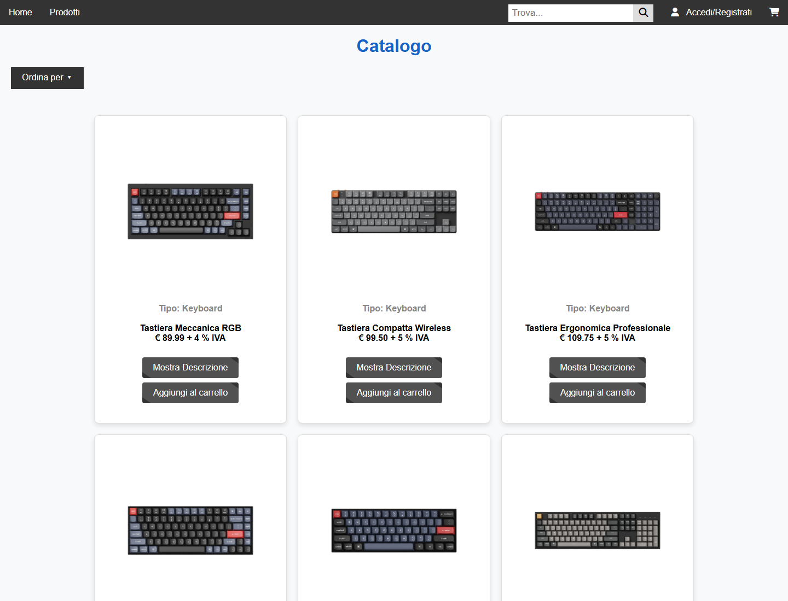
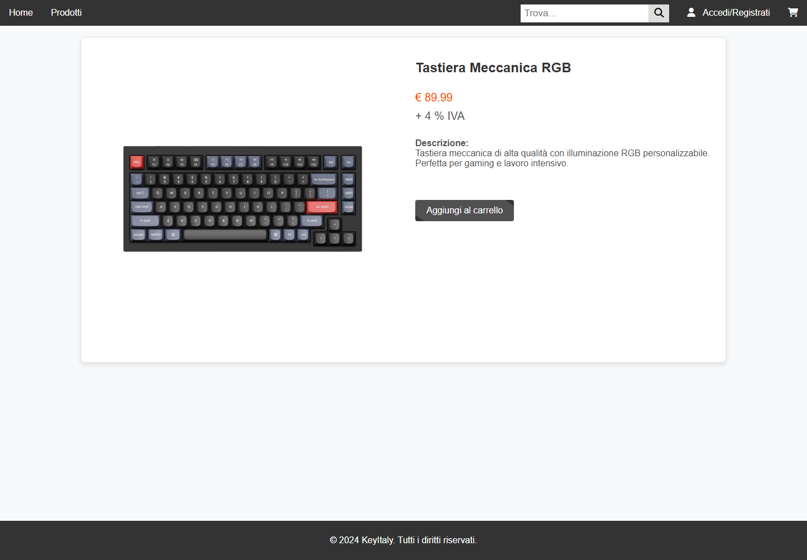
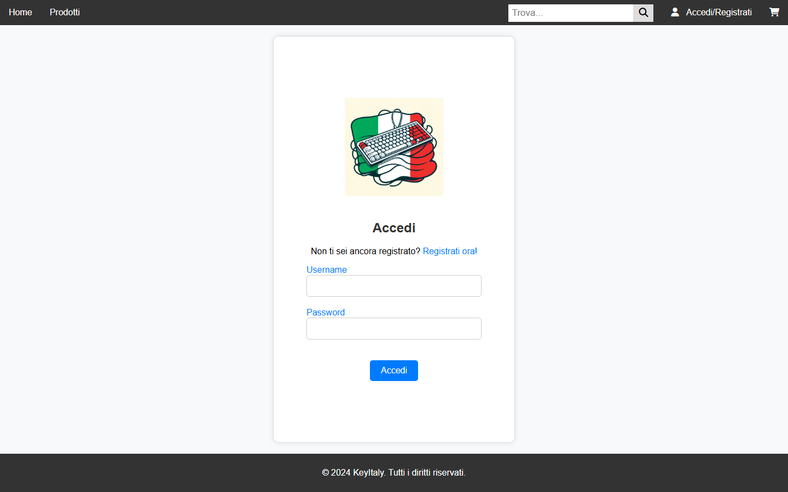

# KeyItaly

E-commerce di tastiere meccaniche e accessori, sviluppato come progetto d'esame
per il corso di **Tecnologie Software per il Web** (Università degli Studi di
Salerno, Corso di Laurea in Informatica, A.A. 2023/2024).


---

## Indice

- [Avvio rapido](#avvio-rapido)
- [Funzionalità](#funzionalità)
- [Schermate](#schermate)
- [Architettura](#architettura)
- [Base di dati](#base-di-dati)
- [Configurazione](#configurazione)
- [Avvio senza Docker](#avvio-senza-docker)
- [Documentazione](#documentazione)
- [Limiti noti](#limiti-noti)
- [Autori e licenza](#autori-e-licenza)

---

## Avvio rapido

L'unico prerequisito è **Docker** con Compose. Maven, MySQL e Tomcat non vanno
installati: arrivano come immagini e vivono dentro i contenitori.

```bash
git clone https://github.com/g-cer/ProgTswCerCom.git
cd ProgTswCerCom
docker compose up --build
```

L'applicazione risponde su **<http://localhost:8080>**. Il database viene creato
e popolato automaticamente al primo avvio con 21 prodotti, alcuni utenti e uno
storico ordini già pronto.

### Utenze di prova

| Ruolo | Username | Password |
|---|---|---|
| Amministratore | `admin` | `admin` |
| Utente registrato | `gianni` | `gianni` |

> Sono credenziali dimostrative in chiaro, presenti nei dati di esempio. Vedi
> [Limiti noti](#limiti-noti).

### Comandi utili

| Comando | Effetto |
|---|---|
| `docker compose up --build` | Compila e avvia l'applicazione |
| `docker compose down` | Ferma tutto, **conserva** i dati del database |
| `docker compose down -v` | Ferma tutto e **azzera** il database, ricaricando i dati di esempio |
| `docker compose logs -f app` | Segue il log di Tomcat |
| `docker compose exec db mysql -ukeyitaly -pkeyitaly keyItaly` | Apre un client SQL sul database |

> **Attenzione:** gli script in `db/init/` vengono eseguiti da MySQL **solo alla
> prima creazione del volume**. Dopo averli modificati serve
> `docker compose down -v && docker compose up --build`, altrimenti le modifiche
> sembreranno non avere effetto.

---

## Funzionalità

### Visitatore non registrato

- Pagina principale con banner delle novità e prodotti in evidenza
- Catalogo completo, con ordinamento per nome, prezzo o tipo
- Navigazione per categoria: tastiere, switch, copritasti
- Pagina di dettaglio del prodotto, con ingrandimento dell'immagine
- Ricerca con suggerimenti asincroni
- Carrello utilizzabile senza autenticazione

### Utente registrato

Tutto quanto sopra, e inoltre:

- Conclusione dell'acquisto con indirizzo di spedizione per singolo ordine
- Storico degli ordini con il dettaglio delle righe
- Download della fattura in PDF
- Modifica di indirizzo predefinito e metodo di pagamento

### Amministratore

- Inserimento, modifica ed eliminazione dei prodotti, con caricamento
  dell'immagine, direttamente dal catalogo
- Elenco di tutti gli ordini, con filtri per cliente e per intervallo di date

---

## Schermate

| Catalogo | Dettaglio prodotto |
|---|---|
|  |  |

| Accesso e registrazione |
|---|
|  |

---

## Architettura

Applicazione Java EE strutturata secondo il modello **MVC**, con Servlet come
controller, JSP come viste e il pattern **DAO** per la persistenza su MySQL via
JDBC. Il pool di connessioni è gestito dal container e recuperato via **JNDI**.

```
src/main/
├── java/
│   ├── config/        risoluzione della configurazione all'avvio
│   ├── control/       21 servlet (ordine, prodotto, search, utente)
│   ├── filter/        controllo accessi e codifica dei caratteri
│   └── model/         bean e DAO (acquisto, ordine, prodotto, utente)
└── webapp/
    ├── css/  js/  images/  pdf/
    ├── pages/         pagine JSP (views/ non accessibili direttamente)
    ├── META-INF/      context.xml: data source JNDI
    └── WEB-INF/       web.xml
```

Il controllo degli accessi è concentrato in tre filtri anziché ripetuto nelle
servlet:

| Filtro | Pattern | Comportamento |
|---|---|---|
| `AdminFilter` | `/admin/*` | Richiede il ruolo amministratore |
| `UserFilter` | `/user/*` | Richiede un utente autenticato |
| `JspFilter` | `/pages/views/*` | Nega l'accesso diretto alle viste (403) |
| `EncodingFilter` | `/*` | Impone UTF-8 sul corpo delle richieste |

Le viste restano raggiungibili solo tramite inoltro interno da una servlet.

---

## Base di dati

Quattro tabelle: `Prodotto`, `Utente`, `Ordine`, `Acquisto`.

```
Utente 1 ──── N Ordine 1 ──── N Acquisto N ──── 1 Prodotto
```

Due scelte meritano una nota:

- **`Acquisto` fotografa prezzo, IVA e immagine** al momento dell'acquisto, così
  una variazione di listino non altera retroattivamente gli ordini conclusi né
  le fatture ristampate a distanza di tempo.
- **La cancellazione dei prodotti è logica** (`tipo = 'Eliminato'`): una
  `DELETE` violerebbe il vincolo di chiave esterna con `Acquisto` e
  cancellerebbe lo storico degli ordini.

Schema e dati di esempio: [`db/init/`](db/init).

---

## Configurazione

Tutti i valori hanno un default: senza configurazione l'applicazione parte
comunque. Per personalizzarla, copiare [`.env.example`](.env.example) in `.env`.

| Variabile | Default | Descrizione |
|---|---|---|
| `APP_PORT` | `8080` | Porta HTTP dell'applicazione sull'host |
| `DB_PORT` | `3307` | Porta MySQL sull'host (la 3306 è spesso già occupata) |
| `DB_NAME` | `keyItaly` | Nome del database |
| `DB_USERNAME` | `keyitaly` | Utente applicativo |
| `DB_PASSWORD` | `keyitaly` | Password dell'utente applicativo |
| `MYSQL_ROOT_PASSWORD` | `root` | Password di root di MySQL |
| `KEYITALY_MEDIA_DIR` | `./immaginiCatalogo` | Directory delle immagini del catalogo |

Le credenziali **non sono scritte nel repository**: `META-INF/context.xml`
contiene segnaposto che Tomcat risolve all'avvio leggendo le variabili
d'ambiente, o le system property `-D` quando si avvia da IDE.

Le immagini dei prodotti vivono fuori dall'applicazione, in una cartella
scrivibile montata nel contenitore: quelle caricate dall'amministratore
compaiono in `immaginiCatalogo/` sul disco e sopravvivono a un nuovo deploy.

---

## Avvio senza Docker

Serve JDK 11 o superiore, Maven, un MySQL in esecuzione e Tomcat 9.

1. **Creare il database** eseguendo, nell'ordine, gli script in `db/init/`.

2. **Copiare il driver JDBC** in `<tomcat>/lib/`. È necessario perché il pool di
   connessioni è gestito dal container e non dall'applicazione:

   ```bash
   mvn dependency:copy -Dartifact=com.mysql:mysql-connector-j:8.0.31 -DoutputDirectory=<tomcat>/lib
   ```

3. **Compilare** l'archivio WAR:

   ```bash
   mvn clean package     # produce target/keyitaly.war
   ```

4. **Configurare le proprietà** nelle opzioni della JVM di Tomcat:

   ```
   -DDB_URL=jdbc:mysql://localhost:3306/keyItaly
   -DDB_USERNAME=<utente>
   -DDB_PASSWORD=<password>
   -Dkeyitaly.media.dir=<percorso>/immaginiCatalogo
   ```

5. **Distribuire** `target/keyitaly.war` in `<tomcat>/webapps/`.

### Eclipse

Importare con *File → Import → Existing Maven Projects* selezionando la cartella
del progetto, poi impostare il runtime in *Project → Properties → Targeted
Runtimes → Apache Tomcat v9.0*. Le proprietà del punto 4 vanno inserite nella
configurazione di avvio del server, sotto *Arguments → VM arguments*.

---

## Documentazione

Il documento di progetto è unico:
**[Project Proposal](docs/project-proposal.pdf)**. Raccoglie la proposta
iniziale — obiettivi, analisi dei competitor, funzionalità, diagramma
navigazionale, mappa dei contenuti, schema della base di dati, layout e palette
— e si chiude con una sezione sul sistema effettivamente realizzato:
architettura, mappa di servlet e filtri, differenze fra schema concettuale e
schema implementato, deployment e limiti noti.

I sorgenti LaTeX sono in [`docs/`](docs) e si compilano con
`latexmk -pdf project-proposal.tex`. I diagrammi sono disegnati in TikZ
([`docs/diagrammi.tex`](docs/diagrammi.tex)) e quindi modificabili senza
strumenti esterni. Il PDF originale della proposta è conservato in
[`docs/original/`](docs/original).

---

## Limiti noti

Il progetto ha finalità didattiche. Alcune scelte, accettabili in quel contesto,
non sarebbero adeguate a un sistema in esercizio; sono elencate qui per
trasparenza e discusse nella relazione tecnica.

- **Password in chiaro** nel database, senza funzione di hash.
- **Nessuna protezione CSRF**; alcune operazioni di modifica accettano anche GET.
- **Output JSP non filtrato** (`<%= %>` senza codifica delle entità HTML):
  possibile cross-site scripting persistente tramite i campi dei prodotti.
- **Giacenza non verificata**: l'acquisto non decrementa né controlla lo stock.
- **Nessun test automatico**: la verifica è stata condotta manualmente.
- **Risorse esterne a runtime**: alcune icone e una libreria JavaScript sono
  caricate da rete, quindi senza connessione la resa grafica è degradata.

---

## Autori e licenza

Progetto realizzato da **Giovanni Cerchia** e **Andrea Compagnone**, per il corso
tenuto dalla Prof.ssa Rita Francese.

Distribuito con licenza [MIT](LICENSE).
